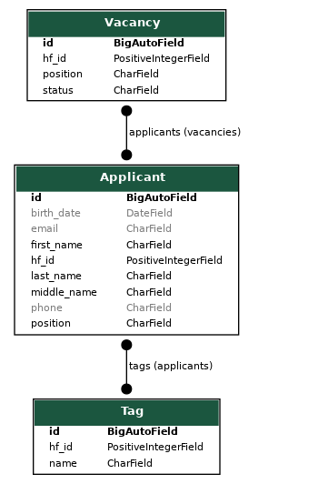

# HuntFlow integration service (HIF)
Back-end rest api and admin interface for HIF. It works with python 3.11.

*(The text of the test task in the test_task.txt file.)*

## Getting Started
The first thing to do is to clone the repository:  
```sh
$ git clone https://github.com/polina-koval/HuntFlowService.git
$ cd HuntFlowService
```

By default you'll encounter sqlite database. Follow [django documentation](https://docs.djangoproject.com/en/4.1/ref/settings/#databases) to change it.
# DB Vizualization


Create a virtual environment to install dependencies in and activate it:  

```sh
$ virtualenv venv  
$ source venv/bin/activate
```

Then install the dependencies:  

```sh
(venv)$ pip install -r requirements.txt
```  
There is a file in the repo ".env.example", this file for use in local development. 
Duplicate this file as .env in the root of the project and update the environment 
variables SECRET_KEY, api keys etc.  

```sh
$ cp .env.example .env
```

Once pip has finished downloading the dependencies and the variable is updated:  
 
Django:
```sh
(venv)$ python manage.py migrate
(venv)$ python manage.py createsuperuser
(venv)$ python manage.py runserver
```

## Main urls
- http://127.0.0.1:8000/admin/ - Admin Area;
- http://127.0.0.1:8000/api/ - API (consist tags, applicants and vacancies endpoints);
- http://127.0.0.1:8000/api/swagger/ - Swagger;
- http://127.0.0.1:8000/api/redoc/ - API Documentation;

## Webhooks
- http://127.0.0.1:8000/api/applicant_webhook/ - Handle applicant webhook.
- http://127.0.0.1:8000/api/vacancy_webhook/ -  Handle vacancy webhook.
## Running the tests
```
pytest
```

## Built with
* [Django](https://www.djangoproject.com/) - The web framework used.
* [Django Rest Framework](https://www.django-rest-framework.org/) - The web APIs framework used.
* [Django-environ](https://django-environ.readthedocs.io/en/latest/) - Used to configure Django app with environment variables.
* [Pytest](https://docs.pytest.org/en/7.2.x/) - Tests.
